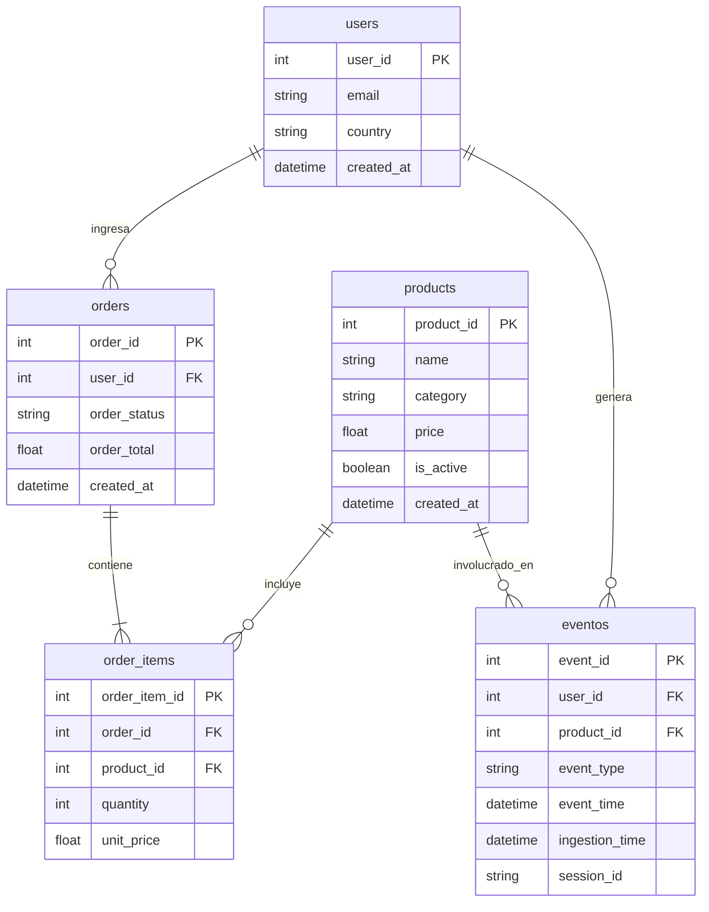
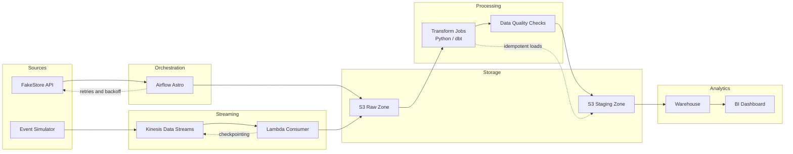

## 📊 Plataforma de Analytics para E-commerce (Batch + Streaming)

## 1. Objetivo

Este proyecto diseña e implementa una plataforma escalable de analytics para un e-commerce, combinando procesamiento **batch** y **streaming en tiempo real** sobre AWS.

La arquitectura separa claramente dos tipos de cargas:

- **Batch analytics** para datos transaccionales (usuarios, órdenes, productos), orquestado con Apache Airflow, orientado a backfills, consistencia, control de costos e idempotencia.
- **Streaming analytics** para eventos de comportamiento (clicks, vistas, add-to-cart), utilizando AWS Kinesis como log distribuido y consumidores serverless para ingestión de baja latencia.

El sistema está diseñado con principios de ingeniería de datos reales:

- Ingestión resiliente con retries y backoff.
- Procesamiento idempotente y deduplicación.
- Separación por zonas (RAW, STAGING, MART).
- Soporte para backfills.
- Enfoque en escalabilidad y optimización de costos.
- Preparado para analítica de negocio (funnels, cohortes, LTV, conversión).

En un entorno productivo, esta arquitectura permite capturar eventos en tiempo real mientras mantiene pipelines batch eficientes para analítica histórica y gobierno de datos.

## 2. Dominio

## 3. Architecture Overview

## 4. Data Zones

- RAW: immutable ingestion layer
- STAGING: cleaned and typed
- CURATED: analytics-ready

## 5. Batch Ingestion

- Source: FakeStore API
- Orchestration: Airflow
- Retries: exponential backoff
- Timeout handling

## 6. Streaming Ingestion

- Source: Event generator
- Transport: Kinesis
- Deduplication via event_id

## 7. Idempotency Design

- File hashing
- Metadata tracking
- MERGE semantics in warehouse

## 8. Late Data Handling

- event_time vs ingestion_time
- Incremental models
- Backfill strategy

## 9. Failure Scenarios

| Scenario | Detection | Mitigation | Recovery |
|---------|----------|-----------|---------|
| API down | timeout | retries | rerun DAG |
| duplicate file | hash | skip | idempotent merge |
| late events | watermark | buffer | backfill |
| partial write | checksum | atomic write | replay |
| cost growth | metrics | lifecycle | pruning |

## 10. Cost Awareness

- S3 storage estimation
- Redshift compute
- Kinesis shards

## 11. Observability

- Logs
- Metrics
- Alerts

## 12. Future Improvements