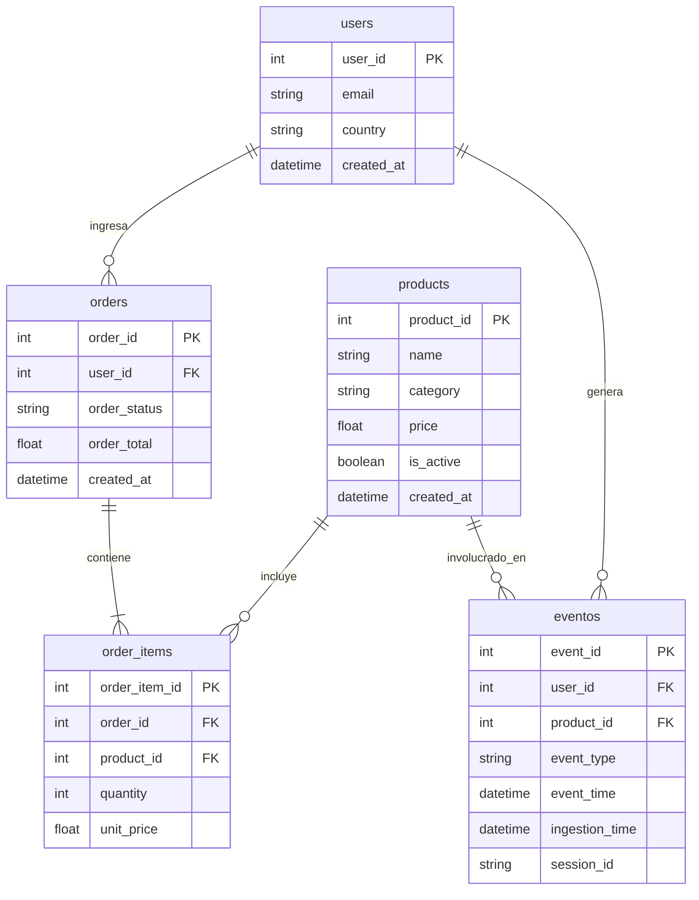

# E-commerce Analytics Platform — Architecture

## 1. Objetivo

Diseñar una plataforma escalable de analytics para un ecommerce. El sistema soporta procesamiento batch y streaming (tiempo real) considerando arquitectura resiliente, idempotente y con enfoques y prácticas para optimización de costos.

## 2. Dominio

Events:
- product_view
- add_to_cart
- checkout
- purchase

Key Metrics:
- revenue
- conversion_rate
- avg_order_value
- funnel_dropoff

## 3. Architecture Overview

[diagram]

## 4. Data Zones

- RAW: immutable ingestion layer
- STAGING: cleaned and typed
- CURATED: analytics-ready

## 5. Batch Ingestion

- Source: FakeStore API
- Orchestration: Airflow
- Retries: exponential backoff
- Timeout handling

## 6. Streaming Ingestion

- Source: Event generator
- Transport: Kinesis
- Deduplication via event_id

## 7. Idempotency Design

- File hashing
- Metadata tracking
- MERGE semantics in warehouse

## 8. Late Data Handling

- event_time vs ingestion_time
- Incremental models
- Backfill strategy

## 9. Failure Scenarios

| Scenario | Detection | Mitigation | Recovery |
|---------|----------|-----------|---------|
| API down | timeout | retries | rerun DAG |
| duplicate file | hash | skip | idempotent merge |
| late events | watermark | buffer | backfill |
| partial write | checksum | atomic write | replay |
| cost growth | metrics | lifecycle | pruning |

## 10. Cost Awareness

- S3 storage estimation
- Redshift compute
- Kinesis shards

## 11. Observability

- Logs
- Metrics
- Alerts

## 12. Future Improvements